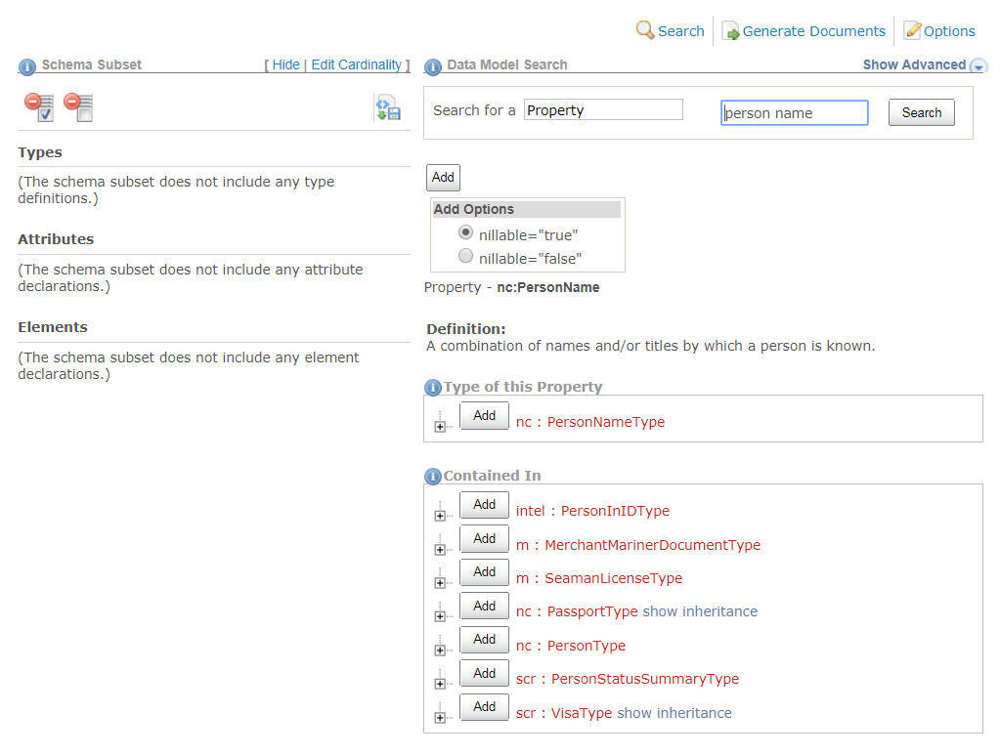

The **[Schema Subset Generation Tool (SSGT)]({{ site.data.links.ssgt }})** enables you to search and explore the content of the NIEM model. Additionally, you have the option of building XML Schema subsets of a NIEM release for use in NIEM XML exchanges. Based on the list of components selected by you for the subset, the tool will calculate dependencies and generate a valid set of schemas that are a subset of a release for download as a zip file.

A NIEM subset will contain only the user-selected elements and types from a release, plus any required dependencies. The subset will likely be much smaller than the corresponding full NIEM release (the 5.0 release has 12,000+ elements) and easier to deal with in an IEPD.

{:.features}
- Search and explore the content of NIEM
- Build XML Schema subsets of a release
  - Automatic management of component dependencies
  - Customize cardinality and nillable values
- Multi-release support
- API for selecting NIEM subset components (wantlist)

{:toc}
- TOC

<!--more-->

## Search

The Schema Subset Generation Tool (SSGT) search function allows you search and navigate through the various NIEM properties, data types, namespaces, codes / facets, and their relationships to each other.


{:.bordered}

{:.box}
> **Tips for better searches**
> - Uses spaces between terms.
> - Do not include namespace prefixes or information (e.g., `nc:`) in the search.
> - Narrow down search results by using the advanced search if too many results are returned.
> - Look through the components of any types that match your requirements - results may sometime appear as inherited elements (e.g., `nc:ArrestType` inherits element `nc:ActivityDate` instead of creating a custom arrest date) or augmentations (additional related properties defined in other namespaces).

### Basic Search

Enter one or more terms into the search box for a default search of NIEM properties.


{: .bordered}

Change the selection in the drop-down box to change the search to one of the following:

| Category    | Comments |
| --------    | -------- |
| Property    | Search NIEM elements and attributes (default). |
| Type        | Search NIEM types. |
| Namespace   | Search namespace prefixes, target namespace URIs, and definitions. |
| Facet       | Search code values and definitions. |
| External    | Search external element names and definitions. |
| Association | Search association element names and definitions. |


{: .bordered}

### Advanced Search

Click the toggle link **`Show Advanced`** / **`Hide Advanced`** to show or hide the advanced search options.


{:.bordered}

When you click the **`Show Advanced`** link, the following options will appear:


{:.bordered}

{:.box}
- Enter search terms in the text-box labeled **`with the exact phrase`** to search multiple terms.
- Enter search terms in the text-box labeled **`with at least one of the words`** to conduct a logical OR search.
- Enter search terms in the text-box labeled **`without the words`** to exclude terms from the search results.
- Uncheck the check-boxes Names, Definition, Keywords, Usage, and Example Content to exclude the unchecked item from being searched for the search terms entered above.
- Filter the list of namespaces to be searched.
  - The checkbox for **`Other`** should likely remain checked - it includes Core.
  - If no checkboxes are checked, no results will be returned.

## Search Results

The properties and types displayed in the search results are hyperlinked to display more detailed information about each component. This helps users navigate through the data model and explore the model hierarchy.


### Search Results List

Some additional information about properties and types may be viewed directly from the search results list.  Detailed information will be available by clicking the links to open the individual [property info pages](#property-info-pages) and [type info pages](#type-info-pages).

**Definitions**

There are two ways to view the definition of a property or type from the search results page:

- Hover over a property or type link to see the definition for that component.
- Toggle the **`details`** link to show/hide definition.  Multiple details panels may be open at the same time.


{:.bordered}

**Sub-properties**

In the list of search results, click the **`+`** button to the left of the component to see the sub-properties that the type contains.

{:.example}
> View the list of sub-properties for **`nc:LengthMeasure`**:


{:.bordered}

**Inheritance**

Once the sub-property list is expanded, a **`show inheritance`** link will appear if the type extends another type with sub-properties.


{:.bordered}

Each parent type may also be expanded to display their sub-properties.

{:.example}
> After clicking **`show inheritance`** and the expand button, the list of sub-properties for **`nc:MeasureType`** (the parent type for **`nc:LengthMeasureType`**) is displayed.  These properties will be inherited:


{:.bordered}

**Substitutions**

For abstract elements, click the **`+`** button to view a list of available substitutions.


{:.bordered}

### Property Info Pages

Clicking on a property link will take you to a page with more information about that property.  Commonly available information includes the definition, the type of the property, and any types that the property may be contained in.

{:.example}
> Page for property **`nc:PersonName`**


{:.bordered}

### Type Info Pages

Clicking on a type link will take you to a page with more information about that type, including the definition, the kind of type it is, the parent or base type, and any elements of this type.

Further information on the page will vary based on what kind of type it is.  The page may display a list of sub-properties, codes, or other facets, as applicable.

**Complex type with sub-properties**

{:.example}
> Page for type **`nc:LengthMeasureType`**


{:.bordered}

**Complex type with a value**

{:.example}
> Page for complex type **`unece:LengthCodeType`**


{:.bordered}

{:.note}
> Where are the codes?  Click on the link to its simple content type, `unece:LengthCodeSimpleType` (identified in the image with the gold arrow).

**Simple type**

{:.example}
> Page for type **`unece:LengthCodeSimpleType`**


{:.bordered}

## Build a Subset

The SSGT allows you to pick and choose specific parts of a release to include in a subset.  This subset, which will likely have many fewer files and components than the full release, can be used in your IEPD.  While you can reuse a full release package, it is easier to understand and work with only the schemas and the components that you need.

If you are developing multiple IEPDs, you can build a custom subset for each one or one larger subset that supports the requirements from each IEPD.

Please see [Subset Schemas]({{ site.data.pages.subset | relative_url }}) for more information about what a subset is.

{:.note}
- This tool does not have user accounts.  To **[save your work](#generate-subset)**, you must download either the individual **wantlist** file (a SSGT-generated XML file that stores your selections) or the **full subset zip file**, which will contain the latest wantlist.
- The **[only way to resume your work](#resume-work-later)** later on without starting over is to keep your latest wantlist file so you can upload it in the SSGT after your session has expired.

**Subset Panel**

When building a subset, you may add elements, attributes, and types directly from the search results page, or from the property and type pages.  All components in your subset will appear in the subset list on the left side of the page.

{:.example}
> The example below shows an empty subset.  No types, attributes, or elements have been added yet.


{:.bordered}

**Dependencies**

The SSGT will automatically calculate all required dependencies whenever a component is added to the subset list.

- User-selected components will appear in bold font in the subset panel.
- Dependencies will appear in regular font.

If you later remove a selected component, dependencies that are no longer necessary will also be removed.

{:.example}
> If you add property `nc:Person` to your subset, the SSGT will also add type `nc:PersonType` to your subset as well since it is a required dependency of the property.  If you later remove `nc:Person` from your subset and no other component needs it, `nc:PersonType` will be removed as well.

### Add Properties

There are three ways of adding properties to a subset from the search results page.  Choices can be made on a case-by-case basis:

**1. Add selected properties independently**

Adding properties independently results in a subset that might look like:

{:.box}
- nc:PersonGivenName
- nc:PersonSurName
- nc:PersonBirthDate
- nc:ItemMakeName
- nc:ItemModelName
- nc:IdentificationID

These properties have been added as a flat list.

{:.note}
> Without providing a nested structure for these properties via the subset (e.g., NIEM's nc:PersonType, nc:ItemType, etc.) or a custom structure in an IEPD schema, then there will be no way to group related data.  If a message with this subset has two given names, two last names, and two birth dates, two separate persons cannot be extracted correctly with any certainty:
> - Are values provided alphabetically?
> - Is the first occurrence of a field for person #1 and the second occurrence of a field for person #2?
> - Do multiple values represent a single person with alias information?

**Steps**

- Click the **`Add`** button next to the element or type name in the search results list.
- The component will be added to the appropriate section in the subset list on the left, in bold font to indicate a user-selection.
- Any dependencies the component may have will also be added to the subset list, in regular font.

{:.example}
> In the example below, element `nc:OrganizationUnit` is added to an existing subset that also contains element `nc:OrganizationName`.
>
> - (1) Click the add button to add the element to the subset.
> - (2) The SSGT will add the selected component to the subset list on the left.
> - (3) The SSGT will also add dependencies to the subset list (the type of the element: `nc:OrganizationType`).


{:.bordered}

**2. Add selected properties nested under a type**

Adding properties nested under a type preserves the relationships defined in the NIEM model.  This might look like:

{:.box}
- nc:CrashDriver
  - nc:PersonName
    - nc:PersonGivenName
    - nc:PersonSurName
  - nc:PersonBirthDate
- nc:Vehicle
  - nc:ItemMakeName
  - nc:ItemModelName
  - nc:VehicleIdentification
    - nc:IdentificationID

Leveraging the structure that NIEM provides can add a lot more context to your exchanges.  Both examples from #1 and #2 include fields to capture first and last name, birth date, and vehicle make, model, and VIN, but #2 is much more informative.

Option #1 is useful when you want to add NIEM properties to your subset so you can build out a custom structure in your IEPD.

In order to add an element or attribute to a subset as a sub-property of a type, this relationship must be captured explicitly.  The SSGT will not do this automatically.  Many properties belong to more than one type; other times a property may be added to a new type in an exchange.

{:.note}
> Any easy way to tell if a property is going to be added as a sub-property is to look at the **`Add`** button.
> - For sub-properties, the button also includes a drop-down icon on the right side to allow users to set sub-property options.
> - Other **`Add`** buttons do not have these options so they do not have this drop-drown:
> 

**Steps to add nested property from search results**

- Click the **`+`** icon next to a component to expand the list of sub-properties.
- From the sub-property list, click the **`Add`** button next to the property name.
- The property will be added to the appropriate **`Elements`** or **`Attributes`** section of the subset list on the left.
- The type, in not already in the subset, will be added to the **`Types`** section of the subset list on the left.
- Click the **`+`** icon next to the type in the subset list to view all of its sub-properties in the subset.

{:.example}
> In the example below, element `nc:OrganizationLocation` is added to the subset as a sub-property of type `nc:OrganizationType`.
>
> - (1) The user expands the list of sub-properties for type `nc:OrganizationType`.
> - (2) The user adds element `nc:OrganizationLocation` to the subset as a sub-property of `nc:OrganizationType`.
> - (3) The SSGT adds the element to the subset list.
> - (4) The SSGT adds the type to the subset list along with its sub-property.


{:.bordered}

**Steps to add nested property from type pages**

Adding sub-properties to a type will happen automatically for any property added to a subset from a type page, in the **`Contains`** section.

{: .example}
> Adding nc:LengthUnitAbstract to the subset from type type page for type nc:LengthMeasureType will automatically add it as nested under the type.


{:.bordered}

**Set cardinality while adding a nested property to a type**

Subsets also let you constrain how many times an element may appear nested within a type.  As a reference model, NIEM usually sets cardinality to optional and over-inclusive (`minOccurs="0" maxOccurs="unbounded"`) to support a wide variety of requirements.

In an exchange, you can customize the cardinality to your exact requirements.  Make elements required, limit occurrences to only once, or set any other cardinality as long as it does not conflict with the original cardinality from NIEM (an element that is required in NIEM cannot be made optional in a subset).

Click the drop-down on the **`Add`** button to set a custom cardinality for the sub-property:


{:.bordered}

Cardinality can also be set after properties have been added to the subset by clicking the "Edit Cardinality" link at the top of the Subset panel.

**3. Add all nested properties to their type**

This option is similar to #2, but instead of selecting certain properties to include nested under a type, all available ones can be added in a single step.

- Click the **`+`** icon next to a component to expand the list of sub-properties.
- From the sub-property list, click the **`Add`** button next to **`Add All`** label.  This will appear above the list of sub-properties.
- The property will be added to the appropriate **`Elements`** or **`Attributes`** section of the subset list on the left.
- The type, if not already in the subset, will be added to the **`Types`** section of the subset list on the left.

{:.note}
> This action affects only the designated type.  It is not recursive.  Any new type added to the subset through this action will be added empty.  Users will need to add additional sub-properties to as needed.

{:.example}
> In the example below, all sub-properties of type `nc:OrganizationType` are added to the subset.
>
> - (1) The user expands the list of sub-properties for type `nc:OrganizationType`.
> - (2) The user clicks the **`Add`** button for **`Add All`**.
> - (3) The SSGT adds the type and all sub-properties to the subset list on the left.
> - (4) The SSGT adds the sub-properties to the Elements section of the subset list.


{:.bordered}

### Add Types

When search results display a list of types, types can be added to the subset directly by clicking their `Add` buttons.  This is useful for when NIEM does not have an exact match for a data requirement, but has a type that can be used directly, extended, or augmented in an IEPD.

- Switch the "Search for a" box from "Property" to "Type" or open a type information page to add a type to your subset.


{:.bordered}

### Remove Components

Properties and types may be removed from a subset.

**Delete Individual Component**

- Mark the checkbox next to the appropriate property, type, or sub-property in the subset list on the left.
- Click the **`Delete Checked`** button to remove all of the selections and dependencies from the subset.


{:.bordered}

{:.note}
> If no checkbox is available next to the component, that is because it is a dependency and cannot be removed manually as long as other components that require it are still in the subset.

**Delete All**

An entire subset may be removed.

- Click the **`Clear Subset`** button.


{:.bordered}

### Generate Subset

- Click **`Generate Documents`**.
- Toggle the **`Include Documentation?`** radio button to either include or remove component definitions.
  - By default, this button will be checked **`yes`** and definitions will be included.
  - Set this to **`no`** if needed to minimize the size of the resulting schemas.
- Click the link to **`Save Subset Schema to a file`** to generate and download a zip file containing the subset schemas.


{:.bordered}

This subset will include a wantlist (wantlist.xml) in the zip file so that it can be loaded in the SSGT at a later date to resume work on the subset.

**Generate Wantlist**

A wantlist can be generated without the full subset package as a way to save work.

From the same **`Generate Documents`** page,

1. Click **`Generate Documents`**.
1. Click **`Save current wantlist to file`**.


{:.bordered}

**Generate Spreadsheet**

Generate a spreadsheet representation of the subset:

From the same **`Generate Documents`** page,

1. Click **`Generate Documents`**.
2. Click **`Save current subset to a spreadsheet file`**.


{:.bordered}

## Options

The options page allows you to see which release is being used, change the selected release, and reload a subset (load wantlist) in order to make additional changes.

Access the options page by clicking on **`Options`** in the SSGT menu bar:


{:.bordered}

### Change Release

The top of the Options page displays which release the SSGT is using.  The SSGT defaults to using the latest release.

You can switch to a different release using the drop-down list.

{:.note}
> The SSGT does not have the capability to migrate a subset from one release to another.  This functionality only exists in the [Migration Tool](../migration).  **Any subset in progress will be automatically deleted if you switch to a different release.**


{:.bordered}

### Resume work later

The SSGT does not provide user accounts.  Instead, the SSGT provides a wantlist file as part of a generated subset package that saves your list of selections.

In order to resume work on a subset, this wantlist must be uploaded into the SSGT.  Click on **`Choose File`** to select your most recent "wantlist.xml" file, either generated individually or as part of a subset package (zip file).


{: .bordered}

If you currently have components in your subset, you can choose to either merge or remove them when uploading a wantlist.

### Additional options

**Nillable default**

In NIEM reference schemas, elements are defined as nillable, which allows for the use of empty tags.

Instance examples:

```xml
<nc:Person/>

<nc:Person>
</nc:Person>

<nc:Person structures:ref="P1"/>
```

Schema example:

```xml
<xs:element name="Person" type="nc:PersonType" nillable="true">
  ...
</xs:element>
```

By default, NIEM subsets are also set to allow empty (nil) values for all elements.  This default may be changed to **`false`** under **`Wantlist Options`** > **`Change Nillable Default Value`**.

{: .bordered}


Nillable may also be set to true or false on specific elements, which will override the default value.

**Wantlist Schema**

Wantlists are XML instances.  The schema that defines the structure of a wantlist is available here from the options page.

{: .bordered}


{:.note}
> There is typically no need to view or use the wantlist schema.  It is provided here for those who choose to build wantlists with another tool and use the SSGT only to calculate the dependencies and generate the subset schemas.

**Domain subsets**

You can add all of the content from a domain to your subset or download the domain subset directly under the `Namespaces` section.

{: .bordered}

