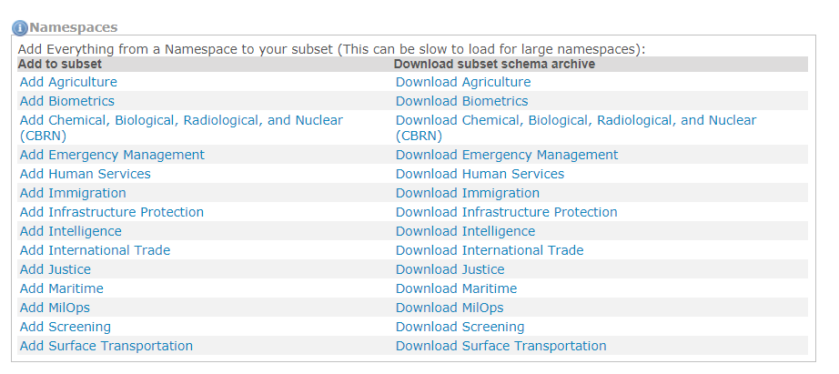

## Wantlist Schema

Wantlists are XML instances.  The schema that defines the structure of a wantlist is available here from the options page.

{: .bordered}

{:.note}
> There is typically no need to view or use the wantlist schema.  It is provided here for those who choose to build wantlists with another tool and use the SSGT only to calculate the dependencies and generate the subset schemas.

See the SSGT's [Web Services API]({{ site.data.links.ssgt_api }}) specification for details on how to access some of the SSGT's functionality through the use of SOAP web services.

## Domain subsets

You can add all of the content from a domain to your subset or download the domain subset directly under the `Namespaces` section.

{: .bordered}

