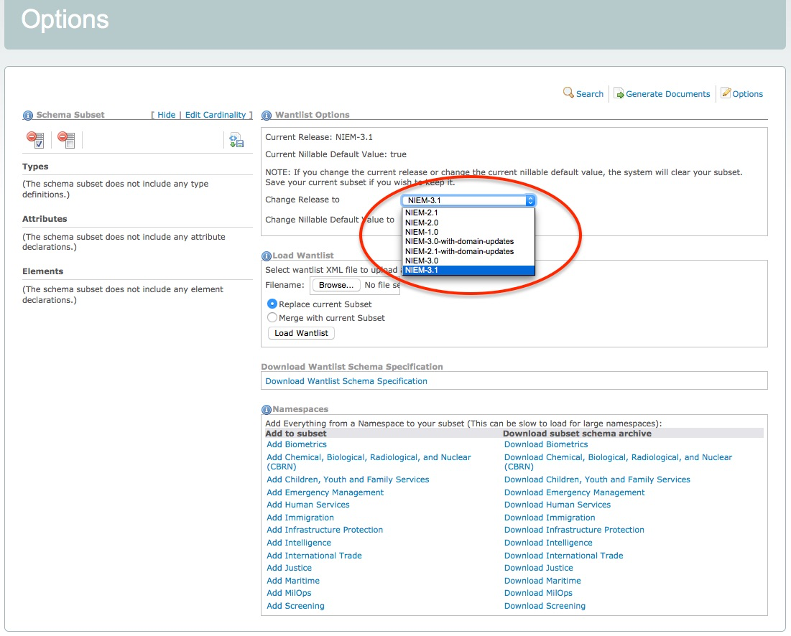

The top of the Options page displays which release the SSGT is using.  The SSGT defaults to using the latest release.

You can switch to a different release using the drop-down list.

{:.note}
> The SSGT does not have the capability to migrate a subset from one release to another.  This functionality only exists in the [Migration Tool](../../../migration).  **Any subset in progress will be automatically deleted if you switch to a different release.**

