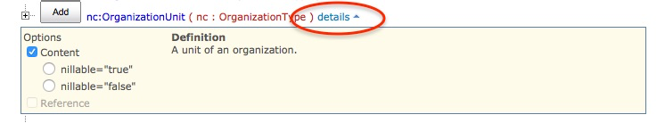
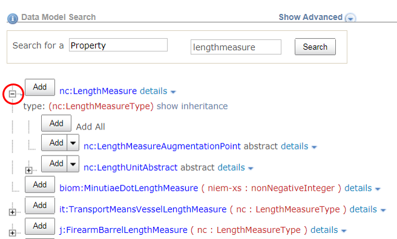
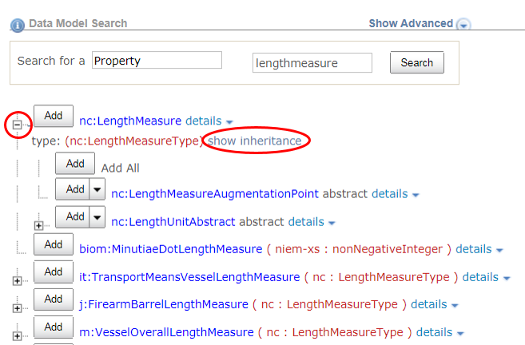

The properties and types displayed in the search results are hyperlinked to display more detailed information about each component. This helps users navigate through the data model and explore the model hierarchy.

Some additional information about properties and types may be viewed directly from the search results list.  Detailed information will be available by clicking the links to open the individual [property pages](properties) and [type pages](types).

## View Definitions

There are two ways to view the definition of a property or type from the search results page:

- Hover over a property or type link to see the definition for that component.
- Toggle the **`details`** link to show/hide definition.  Multiple details panels may be open at the same time.

{:.bordered}

## View Sub-properties

In the list of search results, click the **`+`** button to the left of the component to see the sub-properties that the type contains.

{:.example}
> View the list of sub-properties for **`nc:LengthMeasure`**:

{:.bordered}

## View Inheritance

Once the sub-property list is expanded, a **`show inheritance`** link will appear if the type extends another type with sub-properties.

{:.bordered}

Each parent type may also be expanded to display their sub-properties.

{:.example}
> After clicking **`show inheritance`** and the expand button, the list of sub-properties for **`nc:MeasureType`** (the parent type for **`nc:LengthMeasureType`**) is displayed.  These properties will be inherited:

{:.bordered}

## View Substitutions

For abstract elements, click the **`+`** button to view a list of available substitutions.

{:.bordered}
