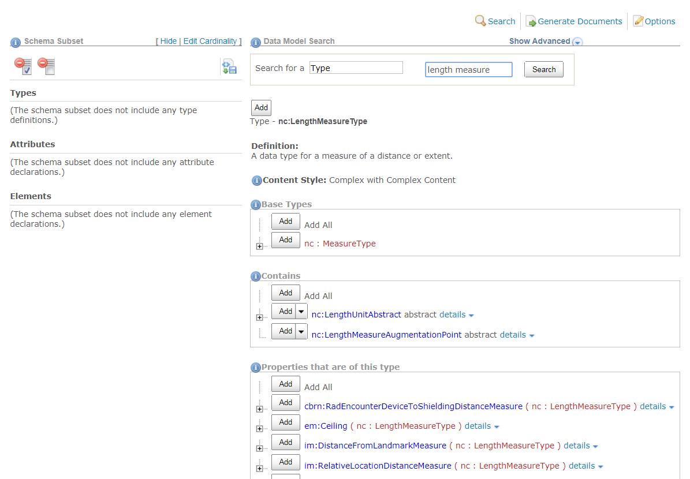
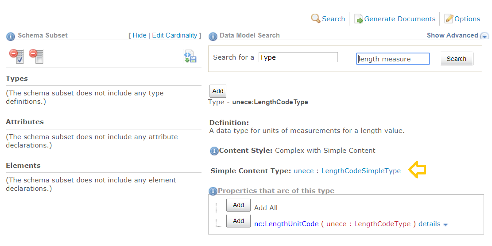
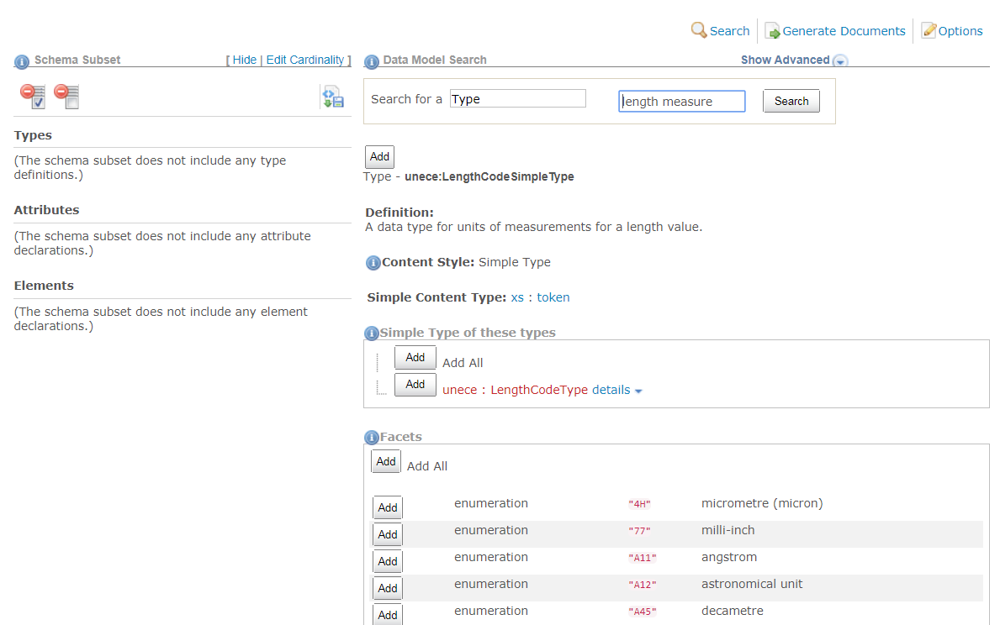

Clicking on a type link will take you to a page with more information about that type, including the definition, the kind of type it is, the parent or base type, and any elements of this type.

Further information on the page will vary based on what kind of type it is.  The page may display a list of sub-properties, codes, or other facets, as applicable.

## Complex type with sub-properties

{:.example}
> Page for type **`nc:LengthMeasureType`**

{:.bordered}

## Complex type with simple content (a value)

{:.example}
> Page for complex type **`unece:LengthCodeType`**

{:.bordered}

{:.note}
> Where are the codes?  Click on the link to its simple content type, `unece:LengthCodeSimpleType` (identified in the image with the gold arrow).

## Simple type

{:.example}
> Page for type **`unece:LengthCodeSimpleType`**

{:.bordered}
