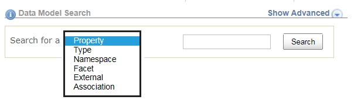
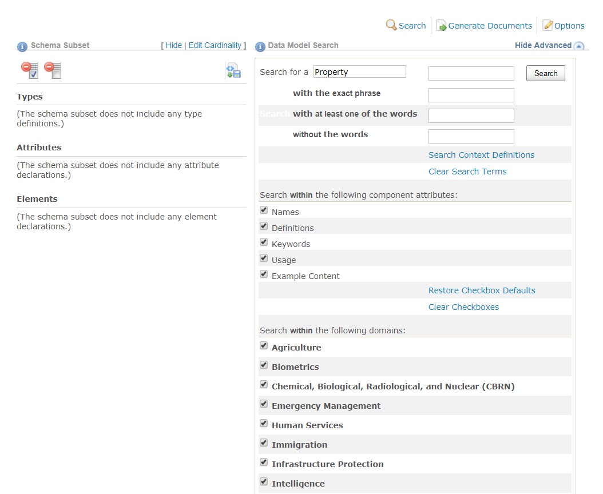

The Schema Subset Generation Tool (SSGT) search function allows you search and navigate through the various NIEM properties, data types, namespaces, codes / facets, and their relationships to each other.

## Tips for better searches

{:.box}
- Uses spaces between terms.
- Do not include namespace prefixes or information (e.g., `nc:`) in the search.
- Narrow down search results by using the advanced search if too many results are returned.
- Look through the components of any types that match your requirements - results may sometime appear as inherited elements (e.g., `nc:ArrestType` inherits element `nc:ActivityDate` instead of creating a custom arrest date) or augmentations (additional related properties defined in other namespaces).

## Quick Search

Enter one or more terms into the search box for a default search of NIEM properties.

{: .bordered}

## Basic Searches

Change the selection in the drop-down box to change the search to one of the following:

| Category    | Comments |
| --------    | -------- |
| Property    | Search NIEM elements and attributes (default). |
| Type        | Search NIEM types. |
| Namespace   | Search namespace prefixes, target namespace URIs, and definitions. |
| Facet       | Search code values and definitions. |
| External    | Search external element names and definitions. |
| Association | Search association element names and definitions. |

{: .bordered}

## Advanced Searches

Click the toggle link **`Show Advanced`** / **`Hide Advanced`** to show or hide the advanced search options.

{:.bordered}

When you click the **`Show Advanced`** link, the following options will appear:

{:.bordered}

- Enter search terms in the text-box labeled **`with the exact phrase`** to search multiple terms.
- Enter search terms in the text-box labeled **`with at least one of the words`** to conduct a logical OR search.
- Enter search terms in the text-box labeled **`without the words`** to exclude terms from the search results.
- Uncheck the check-boxes Names, Definition, Keywords, Usage, and Example Content to exclude the unchecked item from being searched for the search terms entered above.
- Filter the list of namespaces to be searched.
  - The checkbox for **`Other`** should likely remain checked - it includes Core.
  - If no checkboxes are checked, no results will be returned.
