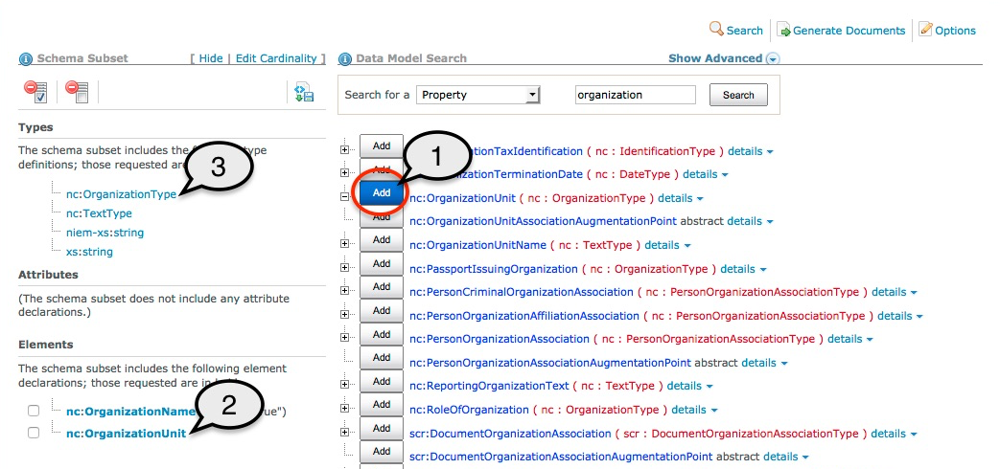

- Click the **`Add`** button next to the element or type name.
- The component will be added to the appropriate section in the subset list on the left, in bold font to indicate a user-selection.
- Any dependencies the component may have will also be added to the subset list, in regular font.

{:.example}
> In the example below, element **`nc:OrganizationUnit`** is added to an existing subset that also contains element **`nc:OrganizationName`**.
>
> (1) The user clicks on the add button to add the element to the subset.  
> (2) The SSGT adds the selected component to the subset list on the left.  
> (3) The SSGT also adds dependencies to the subset list (the type of the element: **`nc:OrganizationType`**).

{:.bordered}
