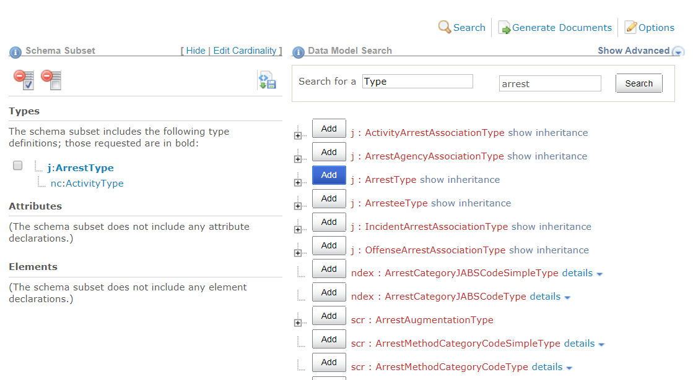

When building a subset, you may add elements, attributes, and types directly from the search results page, or from the property and type pages.  All components in your subset will appear in the subset list on the left side of the page.

{:.example}
> The example below shows an empty subset.  No types, attributes, or elements have been added yet.

{:.bordered}

## Add Properties

There are three ways of adding properties to a subset from the search results page.  Choices can be made on a case-by-case basis:

### 1. Add selected properties independently

Adding properties independently results in a subset that might look like:

{:.box}
- nc:PersonGivenName
- nc:PersonSurName
- nc:PersonBirthDate
- nc:ItemMakeName
- nc:ItemModelName
- nc:IdentificationID

These properties have been added as a flat list.

### 2. Add selected properties nested under a type

Adding properties nested under a type preserves the relationships defined in the NIEM model.  This might look like:

{:.box}
- nc:CrashDriver
  - nc:PersonName
    - nc:PersonGivenName
    - nc:PersonSurName
  - nc:PersonBirthDate
- nc:Vehicle
  - nc:ItemMakeName
  - nc:ItemModelName
  - nc:VehicleIdentification
    - nc:IdentificationID

Leveraging the structure that NIEM provides can add a lot more context to your exchanges.  Both examples from #1 and #2 include fields to capture first and last name, birth date, and vehicle make, model, and VIN, but #2 is much more informative.

Option #1 is useful when you want to add NIEM properties to your subset so you can build out a custom structure in your IEPD.

### 3. Add all properties nested under a type

This option is similar to #2, but instead of selecting certain properties to include nested under a type, all available ones can be added in a single step.

## Add Types

When search results display a list of types, types can be added to the subset directly by clicking their `Add` buttons.

{:.bordered}