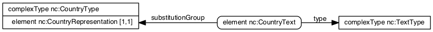
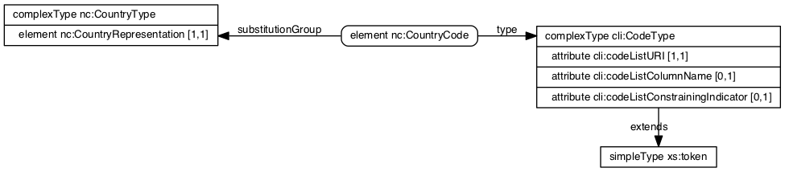

## Status of this document

The NIEM community is in the process of updating the NIEM schemas and related
resources for the NIEM 4.0 release. This document reflects the current thinking
on how NIEM 4 will be updated to best express and convey identification of
countries, using standard country codes. This document should be considered a
draft, subject to comment and revision. Comments are welcome, and should be
submitted via [a Github issue](https://github.com/niem/niem.github.io/issues).

## Abstract

The NIEM 4 release will incorporate updates to the way several code lists are
distributed, and how they are used. The
[NIEM Code Lists Specification](http://niem.github.io/technical/code-lists/niem-code-lists-specification/)
was published in June 2016. It provides:

* Methods for leveraging the spreadsheet CSV (comma-separated values) and Genericode XML
  formats for conveying and distributing code lists.
* Methods for using code lists in XML Schemas to support their use in exchanged messages.
* XML Schema components and methods for run-time exchange of code values.

This document describes how NIEM 4 will be updated to integrate these code list
methodologies for the use and exchange of country codes using public standard
country code lists, specifically GENC (Geopolitical Entities, Names, and Codes)
and ISO 3166-1.

This approach has several parts. The NIEM 4 release will include:

* CSV versions of country code lists for GENC and ISO 3166-1.
* XML Schema components that may be used in messages for identifying countries
  using code values from code lists.
* XML Schema annotations and XML Catalogs that tie the message components to the code lists.

## Introduction

There are two
authoritative sources for country codes incorporated into the NIEM 4 release:
GENC and ISO 3166-1. Both of these, and other representations, use the same
type, `nc:CountryType`, to get country codes into XML Schemas and messages. 

The following diagram shows type `nc:CountryType`, which carries representations
of country across NIEM exchanges. This type uses NIEM's <q>Representation</q>
pattern, as specified in
[the NIEM Naming and Design Rules](https://reference.niem.gov/niem/specification/naming-and-design-rules/3.0/NIEM-NDR-3.0-2014-07-31.html#section_10.7).
This pattern is also used by `nc:Date` and `nc:EntityType`.


In the above diagram, the type `nc:CountryType` is used by `nc:LocationType` and
`nc:DocumentType`. `nc:CountryType` has an element `nc:CountryRepresentation`,
which is place that holds one of a number of ways to identify a country.

In NIEM 4.0, the following representations of country are explicitly represented:

* Text
* ISO 3166-1:
  * 2-character
  * 3-character
  * Numeric
* GENC (latest version, 3-3)
  * 2-character
  * 3-character
  * Numeric

In addition to these representations, other representations may be used with
NIEM 4, either by additional substitutions for `nc:CountryRepresentation`, or by
providing additional code list URIs with `cli:CodeType`.

An IEPD (information exchange package definition), which specifies a message,
may include one or more of these representations to convey countries. Which
representations are used is determined by the community of interest developing
the message specification.

The following sections show how these representations of country identifiers are
built and expressed in NIEM 4.

### Text representation of country ###

Representing country by a text value is the simplest method, but provides
minimal interoperability, as sender and receiver must somehow agree on what any
given value means.

An element `nc:CountryText` carries a text string that identifies a country. It
is one of the representations for a country.



`nc:CountryText` is defined in XML Schema as an element of type `nc:TextType`,
which is substitutable for `nc:CountryRepresentation` using `substitutionGroup`.

```xml
<xs:element name="CountryText" type="nc:TextType" substitutionGroup="nc:CountryRepresentation">
    ...
```

A text representation of the United States of America may appear in an XML message:

```xml
<nc:Document>
  <nc:DocumentOriginCountry>
    <nc:CountryText>United States of America</nc:CountryText>
  </nc:DocumentOriginCountry>
</nc:Document>
```

### ISO 3166-1 country code ###

ISO represents country codes via the ISO 3166-1 standard, which incorporates 3
different representations for each country:

* 2 character (<q>Alpha-2</q>)
* 3 character (<q>Alpha-3</q>)
* Numeric

Each of these is represented in NIEM 4 via an element, which is of a type that
encodes the available code values using `xs:enumeration`, as is done in NIEM 3
for most codes, including for ISO 3166-1. The following pattern will be used for
each of ISO 3166-1's encodings; this example just shows the Alpha-2 encoding.

#### ISO 3166-1 Alpha-2 ####

Although this example shows only the Alpha-2 encoding, this pattern will be
followed for ISO-3166-1's Alpha-2 encoding, its Alpha-3 encoding, and its
Numeric encoding.

First, a diagram showing Alpha2 code, represented by element
`iso_3166:CountryAlpha2Code`, which is of a type based on a `simpleType`
`enumeration` of the valid values for ISO 3166 at the time the codes were
obtained.


An XML message instance using these components appears as follows:

```xml
<nc:Document>
  <nc:DocumentOriginCountry>
    <iso_3166:CountryAlpha2Code
        >US</iso_3166:CountryAlpha2Code>
  </nc:DocumentOriginCountry>
</nc:Document>
```

#### Alternative and rationale ####

An encoding similar to the way we represent GENC, below, was considered for
representing ISO 3166-1 in NIEM 4, but was rejected because of issues specific
to ISO 3166-1, which include:

1. ISO does not publish URIs identifying the ISO 3166 code lists. NIEM would
   have to invent NIEM-specific URIs for ISO's code lists, and NIEM prefers not
   to do so.
1. ISO does not publicly publish identifiers for specific versions of the ISO
   3166 code lists. It is unclear how exchange developers and implementers would
   distinguish between versions of ISO 3166.
1. NIEM 3 used simple type enumerations for ISO 3166-1 code lists, and no issues
   have been submitted that indicate a problem with that representation.

### GENC codes ###

The following pattern is used to represent the GENC codes in NIEM. This includes
the representations of country codes shown below, but is also extended for
Geopolitical subdivisions (e.g., states) described by GENC.  All versions of
GENC use code lists as described by
[The NIEM Code Lists Specification]({{page.href_code_lists_spec}}).

This is made more convenient by:

1. GENC provides an identifying URI for every version of every code list
1. GENC provides machine-readable forms of their code lists
1. GENC documents describe messages that use the code list URI along with code
   values.

#### GENC 3-character country code ####

GENC encodings of country codes use the generic code type `cli:CodeType`
described by
[The NIEM Code Lists Specification]({{page.href_code_lists_spec}}#appendix_B). This
allows for run-time-specified code list
URIs. [A GENC website](https://nsgreg.nga.mil/genc/contentBaseline.jsp?authority=GENC)
identifies the following URIs that identify encodings of the current GENC
Geopolitical entities code list:

* Version 3-3, 2-character encoding: `http://api.nsgreg.nga.mil/geo-political/GENC/2/3-3`
* Version 3-3, 3-character encoding: `http://api.nsgreg.nga.mil/geo-political/GENC/3/3-3`
* Version 3-3, numeric encoding: `http://api.nsgreg.nga.mil/geo-political/GENC/n/3-3`

These encodings incorporate not only the code list (the list of entities) but
particular encodings of codes for the code list (2-character, 3-character,
numeric). As a result, for binding to the code list, a different code list URI
is used for each encoding, and the column name is not used. A sample instance, using a 3-character encoding for the United States of America, appears as follows:

```xml
<nc:Document>
  <nc:DocumentOriginCountry>
    <nc:CountryCode cli:codeListURI="http://api.nsgreg.nga.mil/geo-political/GENC/3/3-3"
        >USA</nc:CountryCode>
  </nc:DocumentOriginCountry>
</nc:Document>
```

This uses the generic code type `cli:CodeType`, provided as part of the NIEM
Code Lists Specification, described by the following diagram:



Here we see that `nc:CountryCode` uses the generic `cli:CodeType`, requiring it
to have a code list URI and optional column name and constraining
indicator. 

The code list for GENC Geopolitical entities, 3-character encoding, is provided
as a CSV file as follows:

char3 code &emsp; | name | short name &emsp; | full name
:--- | :--- | :--- | :---
AFG | AFGHANISTAN &emsp; | Afghanistan | Islamic Republic of Afghanistan
XQZ | AKROTIRI | Akrotiri | Akrotiri
ALB | ALBANIA | Albania | Republic of Albania
… | … | … | …

<br>

This CSV code list file is provided in a sub-directory of the NIEM release,
along with CSVs for the other encodings of the Geopolitical Entities code list,
as well as the Geopolitical Subdivisions code list. These CSV code list files
are identified by XML catalog documents provided as part of the NIEM release.

Users and exchange developers who must (1) update to newer versions of GENC
code lists, or (2) incorporate exchanges using older versions of GENC code
lists, or (3) use code lists other than GENC, in alignment with local exchange
requirements, may do so by using other code list URIs, and may optionally
incorporate new code list files as CSV files or Genericode files in an XML
catalog used with their exchange, as described by the
[NIEM Code Lists Specification]({{page.href_code_lists_spec}}).
