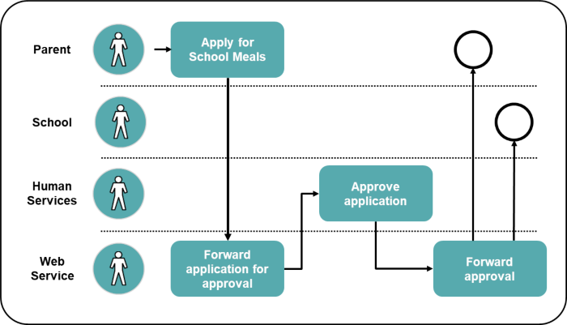

{{ page.description}}



You have graphically defined your scenario, and now you need to define your business rules and requirements, which define the exchange as well as the expectations of the exchange.

## Business Case Example

Currently, the only means a city has to process school meal program applications is through paper-based applications at the city Human Services Agency office. Once approved, the Human Services Agency faxes approved applications to the particular school where the child attends. It is a primarily manual process that inhibits timely delivery of citizen services.

The city government identifies the need to create a series of information exchanges:

- Exchanges that allow resident parents to apply online for their children’s school meals program.
- Exchanges that automate the processing of the parent's request between the Human Services Agency and the school.
- Exchanges that implement a web-based service that, upon submission, automatically checks the city’s Human Services Agency database to ensure the applicant is from a low-income family and qualifies for the school meals program. If qualified, the web-based service notifies the respective school to add the child to the meal program.

Your scenario diagram may look like this:

## Create Effective Requirements

Results can vary between individuals and groups. Examples of good requirements could be the following:

### Candidate Message Exchange Packages

- Request from Parent to meal program eligibility system
- Eligibility reply from Human Services Agency to eligibility system
- Notification to add child to meal program from eligibility system to school
- Notification to add child to meal program from eligibility system to parent

### Performance Requirements

- The web-based service notifies parents via email whether or not their child qualifies for the school meals program ten minutes after receiving their application.
- A school receives notification within 24 hours of a new qualified child within their school.

### Reporting Requirements

Each school in the city receives a monthly report of every child in their school who is currently enrolled in the school meals program.

### Data Quality Requirements

Data Quality Requirements should be taken into consideration once above requirements are discussed.
