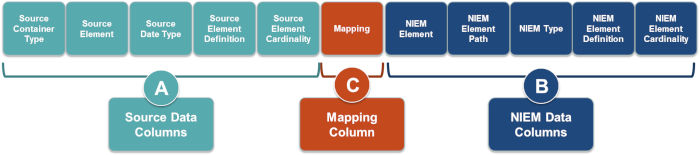
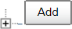

{{ page.description}}



The mapping process consists of the creation of a mapping document and then searching for NIEM elements and mapping them in the document.

Your entries in the document identify the exchange requirements that are well-represented by NIEM, and what needs to be defined as an extension to NIEM.

In the following sections, we provide more detailed information on how you determine what you need to enter.

## What is a Mapping Document

The Mapping Document has the following characteristics:

- Demonstrates where the existing exchange data (or the Exchange Content Model) objects map to NIEM data objects by recording the degree of similarity.

- Helps to identify data objects that are not currently within NIEM as candidates for an Extension Schema Document.

- Helps to communicate the level of reuse of NIEM to business users and owners.

The following illustration shows the recommended structure of a mapping document.

## Mapping Document Setup

Create a blank, nine-column spreadsheet with the headings shown in the previous illustration (Source Container Type, Source Element, etc.). Alternatively you can start with the [sample mapping document we provide](assets/SampleEmptyMappingDocument.xlsx).

{:.note}
>The sample mapping document does not have a way to capture any issues or problems you many encounter. You can add an additional "Notes" column to document problems.

In the following steps, identify (fill in) the **Source Data Columns**:

### Source Data Columns (A)

1. Identify a data object within the existing exchange content model. This is the **Source Container Type**, which is the data source high-level object, class, or context of a set of data elements (e.g., person, vehicle, arrest) to which they belong.

2. Identify an element within that object. This is the **Source Element**, which is a specific data element that is associated with the Source Container Type.

3. Identify the data type for the element. This is the **Source Data Type**, which is the data type (e.g., date, string) of the source element.

4. Provide a definition for the element. This is the **Source Element Definition**, which can be as descriptive as you want it to be.

5. Repeat the previous steps for each object in the Exchange Content Model.

{:.example}
>Four columns should be filled in for every element within the exchange content model.
>
>

### NIEM Data Columns (B) and Mapping Column (C)

After you complete the entries in the Source Data Columns, identify the NIEM elements that may have the same logical definition, semantics, and structure as the source elements.

1. Use a NIEM tool (e.g., Schema Subset Generation Tool ([SSGT]({{ site.data.pages.ssgt | relative_url }}))) to find an element from a NIEM reference schema that “maps” to the exchange data element. In this example, look for a "Property" with "personSSN" as the search string. In general, a "Property" search is a good place to start.

1. If nothing is found that looks like a match, try searching by name, for synonyms, conceptual meaning, or by type. In this example, you found a possible match. ")

1. Enter the match in the mapping document under "NIEM Element." Map objects that are conceptually and semantically equivalent. If the alignment is not easily understood, it is better to extend, which is explained in the schema [build and validate](../build-and-validate "Build and Validate") process. 

1. Note the "type" associated with the NIEM element match and enter it under "NIEM Type." 

1. Open "details" next to the element for the "NIEM Element Definition." This is the standard definition for the NIEM element found in the element’s metadata. Copy that information to the column. 

1. Determine the **Mapping** value, which is the degree to which a source element maps to a NIEM element. This can be a personal judgment. The possible values are the following: 

    | Value | What It Means |
    | --- | --- |
    | Equivalent | Semantics and structure map exactly or almost exactly. The NIEM data object’s name, definition, and containing objects should have exactly the same conceptual meaning and logical alignment as the exchange data object.  For example,  `Person` (exchange data) matches to `nc:Person` (NIEM data object) `Person First Name` (exchange data) matches to `nc:Person/nc:PersonName/nc:PersonGivenName` (NIEM data object) |
    | Partial | A partial match occurs when you can take some things from NIEM and extend the rest for a given Type. In other words, the semantics or structure of exchange and NIEM data objects do not exactly fit. Partial matches can usually be categorized into three conflict categories. Mitigations exist for each of these categories that maintain the integrity of the NIEM data model.  **Semantic** - occurs when there is a small discrepancy in definition or name (e.g., `nc:Date` does not align exactly with `local-ns:EntryDate`). To mitigate, reuse the NIEM data type and create a local element.  **Structural** - occurs when the NIEM data object has constraints that disallow a direct mapping of the exchange data object (e.g., data type mismatches; code lists (enumeration facets) do not have all the necessary entries). To mitigate, reuse the NIEM element, and either create a new data type or extend a NIEM base type.  **Container** - occurs when an exchange data object hierarchy does not match the hierarchy of a desired NIEM data object (e.g., data object contains, or is contained within, elements or types that do not make logical sense or align well). To mitigate,	reuse the NIEM element or type but create local elements or types to contain them. |
    | No Match | No exchange element or type maps to NIEM. Typically this is due to a "new" government or private sector issue or data object that has not made it into the model, or you have uncommon data, such as something very specific to a particular organization. The result is an extension to NIEM through an IEPD extension schema. |

    {:.example}
    >**No Match** - "Cargo Ship" has found a match that would otherwise be equivalent; except, it has a container or structural conflict.  It has this conflict because "Hazmat Indicator" is not found under `nc:Vessel` in the NIEM data model. Therefore, "Hazmat Indicator" has no match, and "Cargo Ship" is only a partial match.
    >
    >| Exchange Data | Mapping | NIEM Data Objects |
    >| --- | --- | --- |
    >| Cargo Ship | Partial Match | `nc:Vessel` |
    >| Hazmat Indicator | No Match | `nc:Vessel/local-ns:HazmatIndicator` |

    In this example, the match is equivalent (the best type of match). Enter "Equivalent" under "Mapping." 

1. Click the expand button (next to **Add**) to open likely relationship trees until the terminal node is revealed. 

1. Click the **Add** button next to the likely elements to begin the schema-creation process and to identify an element path. 

1. Note the **Types** and **Elements** areas are populated when the **Add** button is clicked. 

1. The **NIEM Element Path** is the path of the NIEM element within the NIEM model.  Join the tree elements together to make the path and enter that in the column. 

2. With the information you have now, you can begin the schema [build and validate]({{ site.data.pages.iepd | append: "/lifecycle/build-and-validate" | relative_url }} "Build and Validate") process.

### Model Searching Tips

Searching the NIEM model can be difficult, but these methods can help. Note that the tactics that work using web search engines (like Google or Yahoo) also work with the search tools for the NIEM model.

| Search Method | Explanation | Example |
| --- | --- | --- | --- |
| Name Variations | Searching for variations of a name can often yield results. | Search for **Officer** instead of **Official** to yield `j:EnforcementOfficial`. |
| Conceptual Meaning | Search for words that could be in the definition of the data object. | Search for **Modified Charge** to yield `j:AmendedCharge`. |
| Synonyms | Synonyms of the data object to find exactly what you seek. | Search for **Facility** instead of **Building** to get different results. |
| Containers | Use a more abstract term to find containers of the data objects. | Search for **Person** instead of **Person Arrest** to get the maximum number of results. |

### NIEM Data Model Reuse Considerations

The hierarchical implications of the model must be considered when reusing NIEM elements. NIEM’s hierarchal approach to modeling allows for flexibility and reuse, while still maintaining context.

- Elements and types are defined globally and referenced when used.

- Type hierarchy provides a contextual representation of the element.

- Attributes are assigned to some types to provide context on their use.

")

### Additional Considerations

You should include additional notes in the mapping document to provide reasoning and context. When mapping, be conservative in extending NIEM data objects to maintain the integrity of the NIEM data model.
