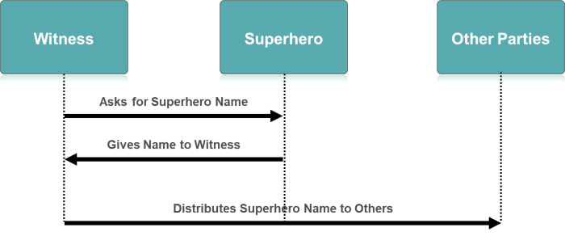
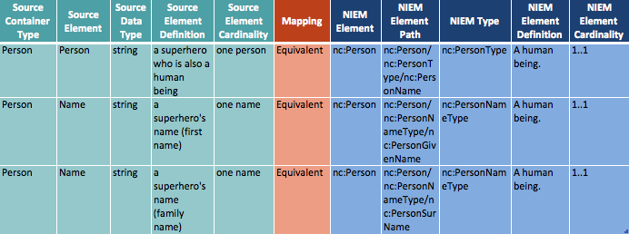

{{ page.description}}

In this tutorial we are going to walk through the creation of a simple IEPD using the [IEPD Lifecycle]({{ site.data.pages.iepd-lifecycle | relative_url }} "IEPD Lifecycle"). These steps include:

1. Scenario Planning - decide what information to include in your exchange
2. Analyze Requirements - break down business context and data requirements
3. Map and Model Requirements - begin mapping your data to NIEM components
4. Build and Validate - create a set of exchange-specific, NIEM-conformant XML schemas
5. Assemble and Document - package all files into a self-contained archive file
6. Publish and Implement - publish the IEPD for search, discovery, and reuse

---

## Scenario Planning

Scenario Planning is the first step in the IEPD development process. In this step you develop a high level scope and goal of the intended information exchange. Decide what information needs to be included.

You observe a person who displays superhuman powers (a SuperHero). As a government official tasked with tracking super powered individuals, you want to inform others of this person's presence and unique characteristics. You talk to personal and professional associates and decide the information should be distributed so that others may learn, or be able to add to the group's knowledge about the SuperHero.

Determine the information that would be useful to gather and the resources needed to obtain and distribute the information. To help visualize the information flow and content, you can develop a [use case, business process, or sequence diagram](../scenario-planning/ "Use Case, Business Process, or Sequence") to graphically show the actors and information flow for your scenario. A visual representation can be useful especially if the scenario is complex.

You decide that acquiring and distributing the super powered person's name is enough.

{:.note}
>The NIEM data model is very large. It is highly likely that the type and format of the data you want to acquire and distribute is already defined. If not, then one of the several [NIEM Communities]({{ site.data.links.niem_communities }} "NIEM Communities") may have tackled a similar problem and developed an information exchange package (IEP) that comes close to meeting your needs. A search through their published resources can help.

{:.example}
>Scenario Information Acquisition and Flow
>
>1. Witness sees a SuperHero display powers.
>1. Witness obtains the SuperHero's name.
>1. Witness distributes information to other parties using an IEPD.
>
>The information flow is illustrated in the following diagram:
>

{:.quiz}
> Answer a few questions in a [short quiz](quiz-1).
<a name="quiz-1-return"/>

---

## Analyze Requirements

After Scenario Planning, you want to analyze the scenario's requirements for the next step in the IEPD development process.

The information exchange scenario now needs to be broken down into finer detail to understand and document the business context and data requirements. There is no prescribed way to to do this, nor is the knowledge of NIEM or XML Schema required. The most important idea to keep in mind is that the subject matter experts capture the requirements and analysis with thorough detail.

The first item you need to determine is the single, main, focal point or purpose for the exchange. This is technically known as the root element. For this simple IEPD, that is the SuperHero.

{:.example}
> root element = `Person`. Assume the SuperHero is a human person.

The content portion of the requirements analysis can be done however you prefer: document, spreadsheet, or model diagram.  The kinds of information to capture include the following:

- Data elements - These are the data fields for the message.  For each field, the following information may or will be needed:
  - Element name - This is the name of the field or tag.  Examples include First Name, Last Name, Street Address, and Phone Number.
  - Data type - The structural representation or format of the element. Examples include string, date, integer, decimal, Boolean, state code set, person data type, location data type.
  - Definition - Descriptive definitions will be required for all components in the exchange. At this stage, the semantics need to be captured, but the wording does not have to be finalized or perfected. If you determine later that an element maps to NIEM, then the NIEM element will come with its own definition. The definition captured here should be sufficient enough so that the meaning is clear.
  - Occurrence constraints - The minimum and maximum number of times an element may appear in the instance. For example, Last Name may occur once only; Social Security Number (SSN) may occur 0 to 1 times; Phone Number may occur 0 to many times.

    Default occurrence constraints in NIEM are 0 to unbounded (with a few exceptions); the default in XML Schema is once only.  Without explicitly setting these occurrence constraints, the defaults mean that components reused from NIEM will be optional and the ones added locally will be required.
  - Source information - Optional. It may be useful or necessary in some cases to record the source of the requirement. Traceability information may seem very apparent at the time but can be difficult to reconstruct at a later date if needed.

{:.note}
>If a corresponding NIEM element is already known at this stage, then the NIEM values may be used in place of local ones for element name, data type, and definition.

- Objects and classes - These are the complex, reusable data structures where related elements are grouped together.  Examples include Person (with elements First Name, Last Name, SSN, and Phone) and Location (with elements Street Address, City, State, and Zip Code).
- Code sets - This is a list of allowable values, such as a state code list or an eye color list.  Code sets may come from a standard or may be custom-defined.
- Conditions and business rules - There may be certain restrictions on the content that need to be represented.  Examples include restrictions on individual values (such as a number that cannot be less than zero or a string that must have a certain number of characters) and conditional restraints (such as if the SSN is not provided, then Last Name and Birth Date are required), etc.

The other requirements of the exchange (e.g., technical, security and privacy, performance, reporting) should be described in this step as well.

{:.quiz}
> Answer a few questions in a [short quiz](quiz-2).
<a name="quiz-2-return"/>

---

## Map and Model Requirements

After you have analyzed and determined your exchange requirements, you proceed to [map and model]({{ site.data.pages.iepd-lifecycle | append: "map-and-model" | relative_url }}) them for the next step in the IEPD development process.

A common way begin the creation of IEPD components for your exchange is to create a mapping document. This is typically a spreadsheet, which maps your local exchange data elements to the NIEM data model. You can [download a sample spreadsheet](../map-and-model/assets/SampleEmptyMappingDocument.xlsx "Sample Mapping Document") and modify it to suit your requirements.

The [Schema Subset Generation Tool (SSGT)]({{ site.data.pages.ssgt | relative_url }} "Schema Subset Generation Tool (SSGT)") is a good tool to use to map your exchange to NIEM. If you are unfamiliar with the SSGT, refer to [Map and Model Training](../map-and-model/ "Map and Model Training"), "What is a Mapping Document." The SSGT's advantage lies in that you can extract just what you need from NIEM, i.e., create a subset.

{:.tip}
>To find matches for your local components, use common words or acronyms in the search box.  Local names will be much less likely to return results.  A search term like "FirstName" or "First_Name" will return empty because these exact terms do not appear in any NIEM names or definitions; a search for "First Name" will return the matching component, `nc:PersonGivenName`, based on a match in the definition.

{:.example}
>
>SSGT search results are sorted by namespace (e.g., **hs:**, **j:**, **nc:**, and so on). The results list can be very long. Take your time looking through it.
>
>1. A search of "Property" for "Person" shows `nc:Person` which is of `nc:PersonType`.
>1. Browse through `nc:PersonType`, and you see it contains `nc:PersonName` which is of `nc:PersonNameTextType`.
>1. Browse through `nc:PersonNameTextType`, and you see it contains `nc:PersonGivenName` and `nc:PersonSurName`. These look like they should fit with our model and complete our search for the time being.

We have enough information from the preceding example to [fill in a mapping document](../map-and-model). Make certain you have your SSGT searches handy so you can fill in the spreadsheet.

### Source Data Columns

- Source Container Type - Person
- Source Element - SuperHero; Given Name; Surname
- Source Data Type - string
- Source Element Definition - a superhero who is also a human being; a superhero's name (first name); a superhero's name (family name)
- Source Element Cardinality - one person; one name; one name

### NIEM Data Columns

- NIEM Element - `nc:Person`; `nc:PersonGivenName`; `nc:PersonSurName`
- NIEM Element Path - `nc:Person`; `nc:PersonGivenName`; `nc:PersonSurName`
- NIEM Type - `nc:PersonType`; `nc:PersonNameTextType`; `nc:PersonNameTextType`
- NIEM Element Definition - A human being.; A first name of a person.; A last name or family name of a person.
- NIEM Element Cardinality - 1..1 (at least one, but no more than one)

### Mapping Column

- Mapping - Equivalent

### Simple Mapping Example

Your mapping document should look like this.



### Generate Subset Schema

For the final step in this phase, [use the SSGT](../map-and-model/ "SSGT Documentation") to generate your new subset schema documentation:

1. Click "Generate Documents."
2. Under "Generate Subset Schema," click "Save Subset Schema to a file."
3. Under "Generate Wantlist," click "Save current wantlist to a file."

The Subset Schema and the Wantlist will form a substantial part of your IEPD. We'll be using these files in the next step, so remember where you save them.

{:.quiz}
> Answer a few questions in a [short quiz](quiz-3).
<a name="quiz-3-return"/>

---

## Build and Validate

You create and validate a set of exchange-specific, NIEM-conformant XML schemas that implement the exchange content model created for the exchange and validate them. Components in this phase also include other XML documents generated from NIEM tools (e.g., Wantlist).

Obtain the documentation the SSGT created for you in [Map and Model](#map-and-model-requirements). This comprises much of your IEPD for the simple exchange, in particular the schema subset.

Create a root directory folder for your IEPD. The name should be meaningful and include the NIEM version and a revision number. For this tutorial we'll name our root directory folder **superhero-iepd-4.0-rev-01**. Create a subdirectory under your root directory called **base-xsd**. Place the subset schema and wantlist files in the base-xsd folder like in the following example.

{:.example}
>
>superhero-iepd-4.0-rev-01
>- base-xsd
>   - niem
>      - niem-core/4.0
>      - proxy/xsd/4.0
>      - utility
>         - appinfo/4.0
>         - conformanceTargets/3.0
>         - structures/4.0
>      - wantlist.xml
>      - xml-catalog.xml

For the purpose of this tutorial, the local exchange components all map to NIEM. In a more complex IEP, there will likely be components that do not map. These would become part of an extension schema that is included in an IEPD, and is discussed in another tutorial.

### Schema Example

There is no automated way to generate the instance schema document. You can copy an existing example and alter it to suit your exchange.

With the mapping components handy, create an instance schema XML document so that it looks like the following (with values added to `nc:PersonGivenName` and `nc:PersonSurName`). Place this file in a subdirectory folder called **iep-sample** under the root directory.

```xml
<?xml version="1.0" encoding="UTF-8"?>
<nc:PersonName xmlns:nc="http://release.niem.gov/niem/niem-core/4.0/">
  <nc:PersonGivenName>Bruce</nc:PersonGivenName>
  <nc:PersonSurName>Wayne</nc:PersonSurName>
</nc:PersonName>
```

{:.quiz}
> Answer a few questions in a [short quiz](quiz-4).
<a name="quiz-4-return"/>

---

## Assemble and Document

You prepare and package all related files for the IEPD into a single, self‐contained, self-documented, portable archive file (e.g., zip) according to the [recommended file-and-folder structure](../assemble-and-document/#assemble-the-iepd). The following example shows where to place relevant artifacts under the root directory.

{:.example}
>
>superhero-iepd-4.0-rev-01
>- base-xsd/
>   - niem/
>     - xsd/
>       - adapters/
>       - codes/
>       - domains/
>       - utility/
>       - niem-core.xsd
>       - wantlist.xml
>       - xml-catalog.xml
>- iepd-catalog.xml (must be in root directory)
>- changelog.txt (.md, .htm, .pdf; must be in root directory)
>- readme.txt (.md, .htm, .pdf; must be in root directory)
>- iep-sample (contains sample xml instances; must be in root directory)
>- conformance-assertion.txt (.md, .htm, .pdf; should be in root directory)
>- documentation (miscellaneous, binaries)
>- schematron (optional; should be in root directory)

Additional artifacts are required in an IEPD. A iepd-catalog is required and must conform to the [IEPD Specification]({{site.data.links.mpd_spec | relative_url}}). Other artifacts such as documentation, sample instances, and schematron rules will not be covered in this tutorial. Schematron rules are not required but can be used to ensure the IEPD is following required business rules.

**IEPD Artifacts:**

- **NIEM schema subset** (required) - The output from the SSGT from the Map and Model step.

- **[ied-catalog.xml]({{site.data.links.mpd_spec | relative_url}}#section_5.1)** (required) - A specially-formatted XML document that contains metadata about the IEPD.
  - Catalog metadata includes:
    - IEPD unique identification
    - Conformance targets
    - Basic information about the IEPD
    - Key artifacts and directory structure
    - Relationships to other IEPDs and their artifacts

- **[changelog]({{site.data.links.mpd_spec | relative_url}}#section_5.3)** (required) - An artifact that describes the changes applied to the IEPD since its previous version. You may choose your own format for the changelog which can simply be the release date.

- **[readme]({{site.data.links.mpd_spec | relative_url}}#section_5.4)** (required) - An informal documentation artifact that includes an initial description or instructional information. This artifact should describe the IEPD purpose, scope, business value, exchange information, typical senders/receivers, interactions, and references to other documentation.

- **[iep-sample]({{site.data.links.mpd_spec | relative_url}}#section_5.6.3)** (required) - A sample xml instance that serves as a test for the IEPD schemas. The sample instance should contain realistic data and use as many data components and validity constraints as possible.

- **[conformance-assertion]({{site.data.links.mpd_spec | relative_url}}#section_5.7)**  - An artifact that provides a declaration that an IEPD conforms to relevant NIEM specifications and associated rules, including [NIEM Conformance 5.0]({{site.data.links.conformance}}), [NIEM Naming and Design Rules 5.0]({{site.data.links.ndr}}), [NIEM Conformance Targets Attribute Specification 3.0]({{site.data.links.conformance_targets}}), and [NIEM IEPD Specification 5.0]({{site.data.links.mpd_spec | relative_url}}).

- **[xml-catalog]({{site.data.links.mpd_spec | relative_url}}#section_5.5)** - An xml instance that describes mappings between external schema references and locally-cached equivalents. A basic xml-catalog will be generated with the subset and can be modified as necessary.

- **[wantlist]({{site.data.links.mpd_spec | relative_url}}#section_6.1)** - An xml file that contains the elements and types from NIEM that will be included within the subset schema for the exchange. In other words, it describes what an exchange "wants" from the NIEM data model. Output from the SSGT during the Map and Model step.

Once you have assembled all required artifacts, compress the root directory folder **superhero-iepd-4.0-rev-01** to a self-contained archive (e.g., zip) file. You should then perform a peer review to ensure artifact consistency within the IEPD and with other IEPDs.

---

## Publish and Implement

Once all artifacts have been assembled and you have compressed your IEPD to a single archive file, you can implement the IEPD into production and publish the IEPD for search, discovery, and reuse.

Publish an IEPD to all repositories that are relevant to the exchange. Many of the [NIEM Communities]({{ site.data.links.niem_communities }} "NIEM Communities") have IEPD repositories where you can search for a package that is suitable or adaptable to your exchange. You may be able to find a home for your exchange with one of them.

You may also wish to publish your IEPD on a service such as [github](https://github.com) for other interested parties to obtain your exchange.

---

## Additional Resources

- [NIEM Conformance 5.0]({{site.data.links.conformance}})
- [Information Exchange Package Documentation Specification 5.0]({{site.data.links.mpd_spec | relative_url}})
- [NIEM Naming and Design Rules 5.0]({{site.data.links.ndr}})
- [Optional IEPD Artifacts]({{site.data.links.mpd_spec | relative_url}}#section_6)
