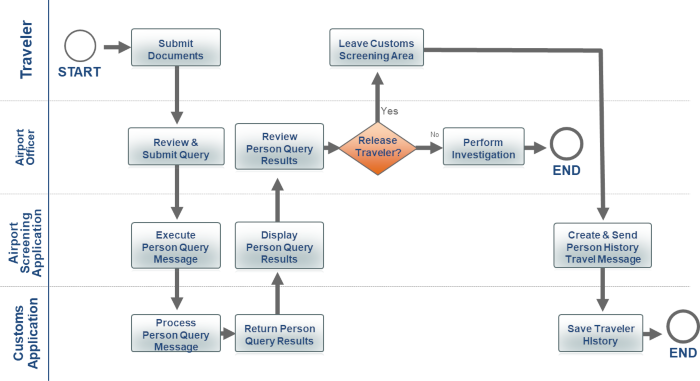

{{ page.description }}

1. (true/false) Any of the following can be created to document the operational “picture” of the information exchange.
- Use Case Scenario
- Business Process Diagram
- Sequence Diagram

    [Answer](answer-1)

1. List the actors in the following Business Process Diagram.
   

    [Answer](answer-2)

[Return to the topic.](../#quiz-1-return)