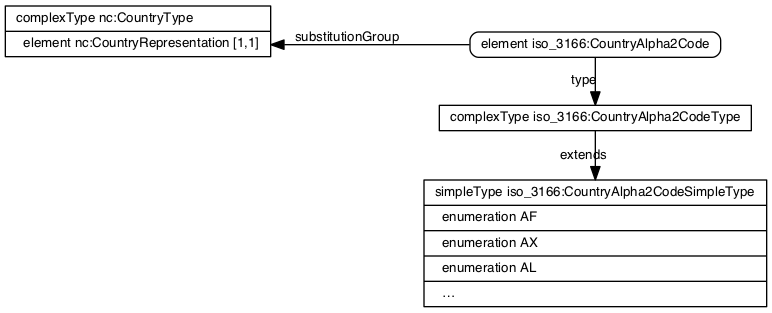

- TOC
{:toc}

## Overview

Country codes in NIEM 4.0 provide a good example of different representations of code lists in NIEM.  ISO 3166 codes are represented as schema enumerations, and GENC codes are represented by CSV files as described by the [Code Lists Specification]({{ site.data.links.code_list_spec }}).

{:.note}
> In addition to using a CSV representation, [country codes in NIEM 4.0](/model/concepts/representation/country-codes/) also follow the [representation pattern](/model/concepts/representation/) to enable better reuse.

Country representations in NIEM:


## Text

Representing country by a text value is the simplest method, but provides minimal interoperability, as sender and receiver must somehow agree on what any given value means.

An element `nc:CountryText` carries a text string that identifies a country. It is one of the representations for a country.


`nc:CountryText` is defined in XML Schema as an element of type `nc:TextType`, which is substitutable for `nc:CountryRepresentation` using `substitutionGroup`.

```xml
<xs:element name="CountryText" type="nc:TextType"  substitutionGroup="nc:CountryRepresentation">
```

A text representation of the United States of America may appear in an XML message:

```xml
<nc:Document>
  <nc:DocumentOriginCountry>
    <nc:CountryText>United States of America</nc:CountryText>
  </nc:DocumentOriginCountry>
</nc:Document>
```

## Schema Enumerations

ISO represents country codes via the ISO 3166-1 standard, which incorporates three different representations for each country:

- 2 character ("Alpha-2")
- 3 character ("Alpha-3")
- Numeric

Each of these is represented in NIEM 4 via an element, which is of a type that encodes the available code values using enumerations, as NIEM has done traditionally.

Although this example shows only the Alpha-2 encoding, this pattern will be followed for ISO-3166-1's Alpha-2 encoding, its Alpha-3 encoding, and its Numeric encoding.

First, the diagram below shows the alpha2 codes, represented by element `iso_3166:CountryAlpha2Code`, which is of a type based on a simple type with enumerations.



An XML message instance using these components appears as follows:

```xml
<nc:Document>
  <nc:DocumentOriginCountry>
    <iso_3166:CountryAlpha2Code>US</iso_3166:CountryAlpha2Code>
  </nc:DocumentOriginCountry>
</nc:Document>
```

An encoding similar to the way we represent GENC, below, was considered for representing ISO 3166-1 in NIEM 4, but was rejected because of issues specific to ISO 3166-1, which include:

1. ISO does not publish URIs identifying the ISO 3166 code lists. NIEM would
   have to invent NIEM-specific URIs for ISO's code lists, and NIEM prefers not
   to do so.
1. ISO does not publicly publish identifiers for specific versions of the ISO
   3166 code lists. It is unclear how exchange developers and implementers would
   distinguish between versions of ISO 3166.
1. NIEM 3 used simple type enumerations for ISO 3166-1 code lists, and no issues
   have been submitted that indicate a problem with that representation.

## CSV codes

The following pattern is used to represent the GENC codes in NIEM. This includes the representations of country codes shown below, but is also extended for Geopolitical subdivisions (e.g., states) described by GENC.  All versions of GENC use code lists as described by [The NIEM Code Lists Specification]({{ site.data.links.code_list_spec }}).

This is made more convenient by:

1. GENC provides an identifying URI for every version of every code list
1. GENC provides machine-readable forms of their code lists
1. GENC documents describe messages that use the code list URI along with code
   values.

GENC encodings of country codes use the generic code type `nc:CodeType` described by [The NIEM Code Lists Specification]({{ site.data.links.code_list_spec }}#appendix_B). This allows for run-time-specified code list URIs. [A GENC website](https://nsgreg.nga.mil/genc/contentBaseline.jsp?authority=GENC) identifies the following URIs that identify encodings of the current GENC Geopolitical entities code list:

| Version | Encoding | URI |
| ------- | -------- | --- |
| 3-3 | 2-character encoding | <http://api.nsgreg.nga.mil/geo-political/GENC/2/3-3> |
| 3-3 | 3-character encoding | <http://api.nsgreg.nga.mil/geo-political/GENC/3/3-3> |
| 3-3 | numeric encoding | <http://api.nsgreg.nga.mil/geo-political/GENC/n/3-3> |

These encodings incorporate not only the code list (the list of entities) but particular encodings of codes for the code list (2-character, 3-character, numeric). As a result, for binding to the code list, a different code list URI is used for each encoding, and the column name is not used.

A sample instance, using a 3-character encoding for the United States of America, appears as follows:

```xml
<nc:Document>
  <nc:DocumentOriginCountry>
    <nc:CountryCode cli:codeListURI="http://api.nsgreg.nga.mil/geo-political/GENC/3/3-3"
        >USA</nc:CountryCode>
  </nc:DocumentOriginCountry>
</nc:Document>
```

This uses the generic code type `nc:CodeType`, provided as part of the NIEM Code Lists Specification, described by the following diagram:


Here we see that `nc:CountryCode` uses the generic `nc:CodeType`, requiring it to have a code list URI and optional column name and constraining indicator.

The code list for GENC Geopolitical entities, 3-character encoding, is provided as a CSV file as follows:

char3 code | name | short name | full name
--- | ---- | ---- | --- |
AFG | AFGHANISTAN | Afghanistan | Islamic Republic of Afghanistan
XQZ | AKROTIRI | Akrotiri | Akrotiri
ALB | ALBANIA | Albania | Republic of Albania
... | ... | ... | ...

This CSV code list file is provided in a sub-directory of the NIEM release, along with CSVs for the other encodings of the Geopolitical Entities code list, as well as the Geopolitical Subdivisions code list (`niem/codes/genc`). These CSV code list files are identified by XML catalog documents provided as part of the NIEM release (`niem/xml-catalog.xml`).

Users and exchange developers who must (1) update to newer versions of GENC code lists, or (2) incorporate exchanges using older versions of GENC code lists, or (3) use code lists other than GENC, in alignment with local exchange requirements, may do so by using other code list URIs, and may optionally incorporate new code list files as CSV files or Genericode files in an XML catalog used with their exchange, as described by the [NIEM Code Lists Specification]({{ site.data.links.code_list_spec }}).
