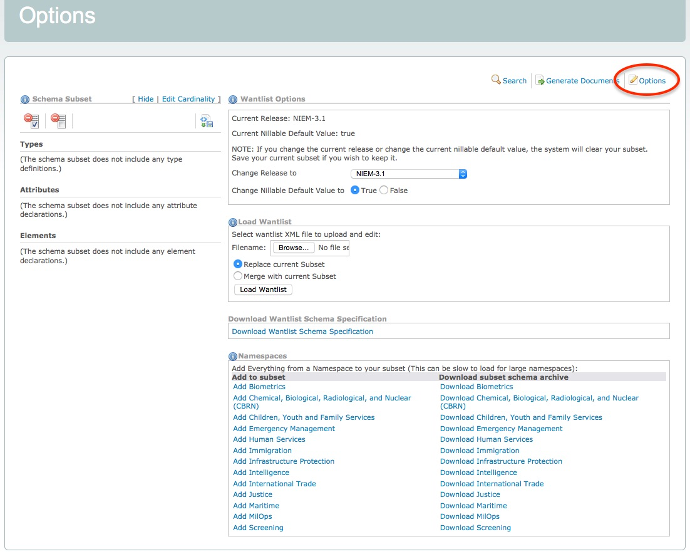
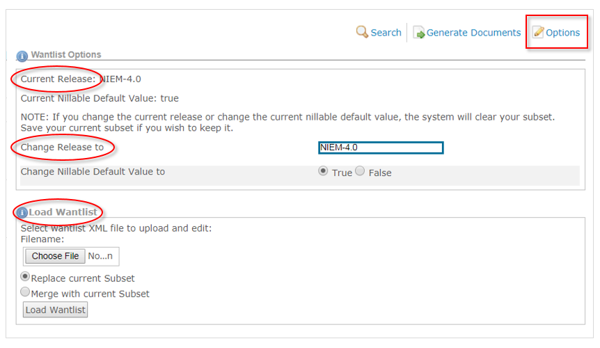
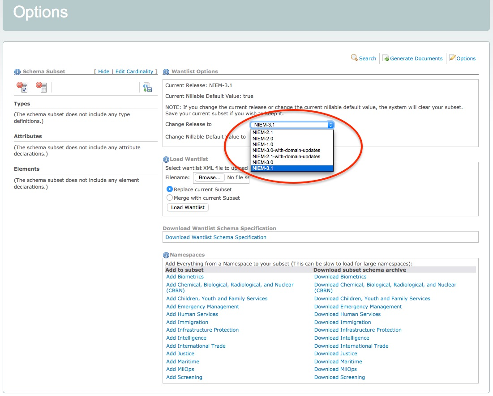
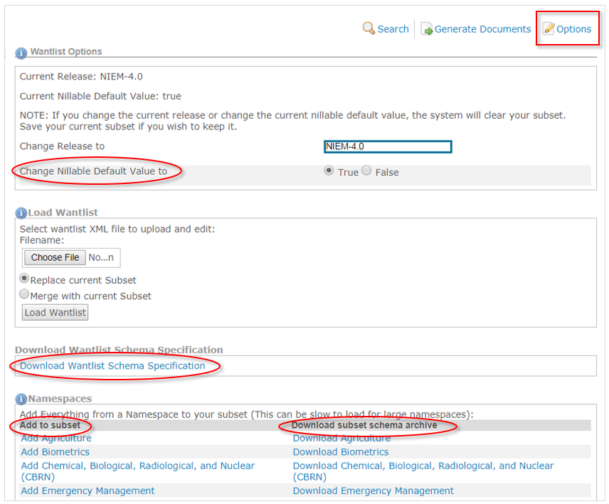

- TOC
{:toc}

## Overview

The options page allows you to see which release is being used, change the selected release, and reload a subset (load wantlist) in order to make additional changes.

Access the options page by clicking on "Options" in the SSGT menu bar:



## Basic Options



### Current Release

View which release the SSGT is currently using.  This will be the latest release.

### Change Release

By default, the SSGT is set to the latest NIEM release.  You can change the SSGT to use a different release by selecting a different one from the drop-down.



{:.note}
> The SSGT does not have the capability to migrate a subset from one release to another.  Any subset in progress will be automatically deleted if you switch to a different release.

### Load Wantlist

The SSGT does not provide user accounts.  Instead, the SSGT provides a wantlist file as part of a generated subset package that saves your list of selections.

In order to resume work on a subset, this wantlist must be uploaded into the SSGT.  Click on "Choose File" to select your most recent "wantlist.xml" file, either generated individually or as part of a subset package (zip file).

If you currently have components in your subset, you can choose to either merge or remove them when uploading a wantlist.

## Additional Options



### Nillable default

In NIEM reference schemas, elements are defined as nillable, which allows for the use of empty tags.

Instance examples:

```xml
<nc:Person/>

<nc:Person>
</nc:Person>

<nc:Person structures:ref="P1"/>
```

Schema example:

```xml
<xs:element name="Person" type="nc:PersonType" nillable="true">
  ...
</xs:element>
```

By default, NIEM subsets are also set to allow nil values for all elements.  The default may be changed to `false` under "Wantlist Options" / "Change Nillable Default Value".

{:.note}
> Nillable may also be set to true or false for each element individually when added to a subset, which will override the default value set here.

### Wantlist schema

Wantlists are XML instances.  The schema that defines the structure of a wantlist is available here.

{:.note}
> There is typically no need to view or use the wantlist schema.  It is provided here for those who choose to build wantlists with another tool and use the SSGT only to calculate the dependencies and generate the subset schemas.

### Domain subsets

You can add all of the content from a domain to your subset or download the domain subset directly under the "Namespaces" section.
