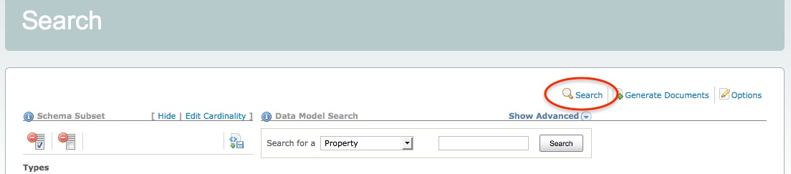
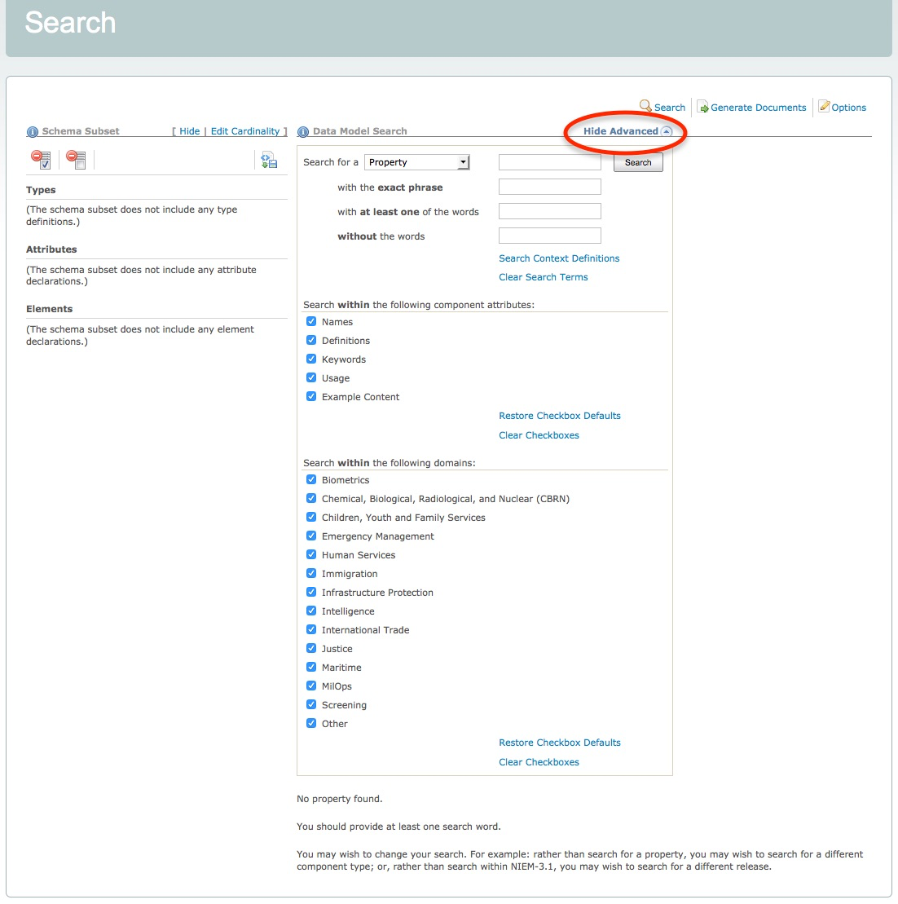

## Overview

The Schema Subset Generation Tool (SSGT) search function allows you to:

- Enter search terms and view matching results in a data hierarchy format.
- Navigate through the various data types, properties, namespaces, and facets and their relationships.
- Select advanced search options to refine your search results.

{:.note}
> Click on the "Search" link to access the search page.

## Quick Search

Enter one or more terms into the search box for a default search of NIEM properties.

## Basic Searches

Change the selection in the drop-down box to change the search to:

| Category    | Comments |
| --------    | -------- |
| Property    | Search NIEM elements and attributes (default) |
| Type        | Search NIEM types |
| Namespace   | Search namespace prefixes, target namespace URIs, and definitions |
| Facet       | Search code values and definitions |
| External    | Search external element names and definitions |
| Association | Search association element names and definitions |

## Advanced Searches

- Click the toggle link Show Advanced to show advanced search options.
- Click the toggle link Hide Advanced to hide advanced search options.
- Enter search terms in the text-box labeled `with the exact phrase` to search multiple terms.
- Enter search terms in the text-box labeled `with at least one of the words` to conduct a logical OR search.
- Enter search terms in the text-box labeled `without the words` to exclude terms from the search results.
- Uncheck the check-boxes Names, Definition, Keywords, Usage, and Example Content to exclude the unchecked item from being searched for the search terms entered above.
- Filter the list of namespaces to be searched.
  - The checkbox for `Other` should likely remain checked - it includes Core.

{:.note}
> If no checkboxes are checked, no results will be returned.

## Tips for better searches

- Uses spaces between terms
- Do not include namespace information (like the prefix) in the search
- Narrow down search results by using the advanced search if too many results are returned
- Look through the components of any types that match your requirements - results may sometime appear as inherited elements (e.g., nc:ArrestType inherits element nc:ActivityDate) or augmentations (additional related properties defined in other namespaces).
